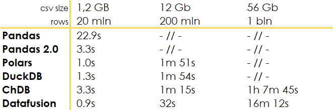

# Evolving Data Analytics Speed: Pandas Versus Today Libraries

    

The landscape of data analytics has been evolving rapidly, with Python remaining at its core. Among the myriad of libraries available, Pandas has stood out for its versatility and ease of use, often being paired with libraries like Matplotlib for plotting and Scikit-learn for machine learning. Its widespread application spans across fields such as data analysis, financial modeling, and preprocessing in both academia and industry.

However, as the size and complexity of datasets grow, the quest for more efficient data processing tools becomes crucial. While Pandas offers commendable performance for a variety of tasks, it's not without limitations, prompting a search for alternative solutions.

## Why Look Beyond Pandas
1. **Performance**: Although Pandas is sufficient for many use cases, it's not the fastest for all scenarios.
2. **Parallel Processing**: Pandas lacks native support for parallel processing, limiting its efficiency for large-scale operations.
3. **Memory Usage**: Handling large datasets in Pandas can be memory-intensive, often requiring more memory than the size of the data.
4. **Complex Syntax**: New users may find Pandas' syntax challenging, especially for complex operations.

So whats alternatives can be chosen for pandas in 2023. It depends from a lot of factors like size of the data, requirements for speed and you environment. In this article I’ll try to test several libraries on very common use case of transforming data from CSV file on one-node laptop.

 
## Alternatives to Pandas in 2023

###  Polars

<a href="https://github.com/pola-rs/polars">Polars</a> is a high-performance library for manipulating structured data, written in Rust. It utilizes parallel processing and features a lazy execution mode, leveraging the Apache Arrow engine to significantly speed up computations.  

### DuckDB

<a href="https://github.com/duckdb/duckdb">DuckDB</a> is a relational DBMS that supports SQL. DuckDB contains a columnar-vectorized query execution engine, written on C++, where queries are still interpreted, but a large batch of values (a “vector”) are processed in one operation. Vectorized query execution leads to far better performance in OLAP queries.

### Pandas 2.0

In 2.0 release, the big change is related to the introduction of the Apache Arrow server side for pandas data. PyArrow takes care of the previous memory limitations of version 1.X and allows for faster and more memory-efficient data operations, especially for large datasets.

### chDB

<a href="https://github.com/chdb-io/chdb">ChDB</a> is an embedded Clickhouse engine through MemoryView. In a simple words you can use power of fast vector database in you python script with out the need of deploying Clickhouse.

### Datafusion

<a href="https://github.com/apache/arrow-datafusion">DataFusion</a>, is written in Rust Python library that binds to Apache Arrow in-memory query engine DataFusion. Execute queries using SQL or DataFrames against CSV, Parquet, and JSON data sources

## Comparative Analysis
### Test Setup
- **Hardware**: Intel Xeon Icelake, 32 GB RAM, Ubuntu 20.04.
- **Objective**: Speed up the transformation of large datasets (10-100 GB) within a Python environment.
- **Method**: Processing CSV files with filtering and aggregation tasks across different file sizes but identical structures.

### Results

The results indicate a considerable performance improvement when using modern libraries compared to traditional methods.

### Disclaimer

This comparison is not a professional benchmark, and given the active development of these packages, results may vary over time. All source scripts and datasets used for this test are available at this <a href="https://github.com/pzlav/against_pandas">GitHub repository</a>.
 
## Conclusion

1. **Utilize OLAP Databases**: For the fastest data processing, OLAP databases are preferable, though Python libraries offer additional flexibility with UDFs and UDAFs.
2. **Alternatives to Pandas**: There are several alternatives for complex tasks that can expedite your work significantly.
3. **Beyond the Classic Trio**: The traditional combination of Pandas, NumPy, and Sci-kit is no longer the only choice for data analysis.
4. **Syntax Preferences**: If you prefer SQL-like syntax, there are plenty of options available.
5. **Library Selection**: Modern libraries offer a diverse range of tools. Choose according to your specific needs.

As data analytics continues to evolve, staying informed about the latest developments in library capabilities is essential for efficient data processing and analysis.
